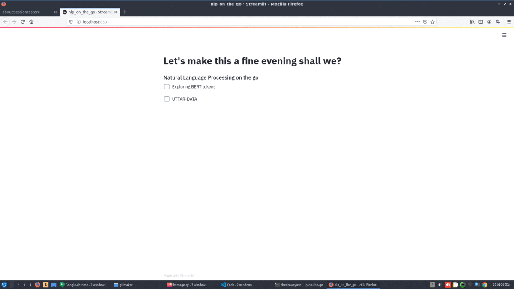

# Natural Language Processing on the GO!

This is a simple web application leveraging different NLP tools.

## Features:
- Uses Streamlit for the web interface
- Bert Tokenizer
- Question Answering Module: You may use your custom fine tuned AlBERT model , or a default model has been given ( https://huggingface.co/ktrapeznikov/albert-xlarge-v2-squad-v2 )

### Demo


### How to run this code:
```sh
streamlit run nlp_on_the_go.py
```
